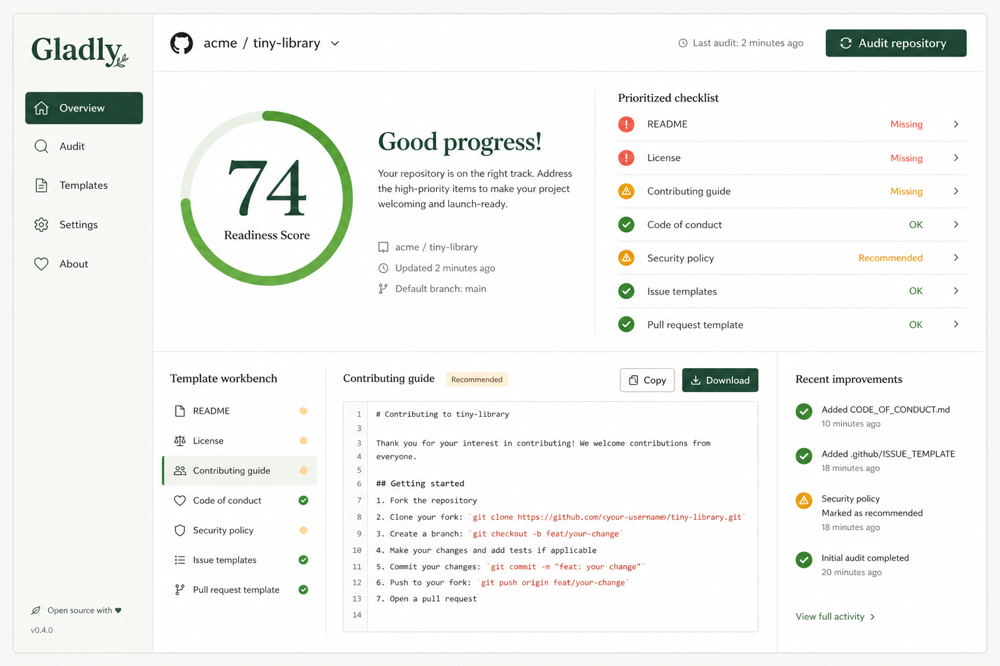

# Gladly

**A local-first readiness workbench for open-source repositories.**

Gladly audits the community-health files in any public GitHub repository, turns the gaps into a prioritized checklist, and generates thoughtful starter templates you can edit, copy, and download without creating an account.



## Why Gladly?

A repository can have excellent code and still feel difficult to join. New contributors quietly look for a README, a license, contribution guidance, issue templates, and a responsible way to report security problems. Missing files create uncertainty at exactly the moment someone is considering helping.

Gladly makes that invisible friction visible.

## What it does

- Audits nine open-source readiness signals with a transparent weighted score.
- Accepts a public GitHub URL or an `owner/repository` slug.
- Explains why each missing or recommended file matters.
- Generates contextual starter files for the selected repository.
- Lets you edit, copy, reset, and download templates in the browser.
- Creates shareable audit URLs with `?repo=owner/repository`.
- Includes an offline demo so the interface is immediately explorable.
- Keeps the audit engine independent from React so it can later power a CLI or GitHub Action.

## Audited signals

| Signal | Weight | Category |
| --- | ---: | --- |
| README | 20 | Essentials |
| License | 15 | Essentials |
| Repository description | 5 | Essentials |
| Contributing guide | 15 | Collaboration |
| Code of conduct | 10 | Collaboration |
| Issue templates | 10 | Collaboration |
| Pull request template | 10 | Collaboration |
| Security policy | 10 | Stewardship |
| Changelog | 5 | Stewardship |

The score is deliberately understandable: completed signals contribute their listed weight, and incomplete items are prioritized by impact.

## Run it locally

You need [Node.js](https://nodejs.org/) 20 or newer.

```bash
git clone https://github.com/Mangomangoman1/GladlyOSS.git
cd GladlyOSS
npm install
npm run dev
```

Then open the local URL Vite prints in your terminal.

## Useful commands

```bash
npm run dev       # Start the local development server
npm test -- --run # Run the complete test suite once
npm run check     # Type-check the project
npm run build     # Create a production build
```

## Architecture

Gladly is intentionally small and easy to extend:

```text
src/
  components/       React interface pieces
  lib/audit.ts      Weighted rules, scoring, and demo snapshot
  lib/github.ts     Public GitHub API adapter
  lib/templates.ts  Contextual starter-file generation
```

The browser calls GitHub's public API directly. There is no server, account system, token storage, or analytics layer.

## Roadmap

The first release is a useful starting point, not the finish line. Good next additions include:

- A CLI for auditing local repositories before they are public.
- A GitHub Action that comments on readiness changes in pull requests.
- Authenticated audits with higher API limits.
- Custom rules for different project types and organizations.
- Exportable Markdown reports.
- A guided pull request flow that adds selected generated files.
- Documentation quality and accessibility checks.

See [CONTRIBUTING.md](CONTRIBUTING.md) for practical ways to help.

## Privacy

Gladly runs in your browser. Repository audits use GitHub's public API, and generated templates stay local unless you choose to copy or download them.

## License

Gladly is available under the [MIT License](LICENSE).
